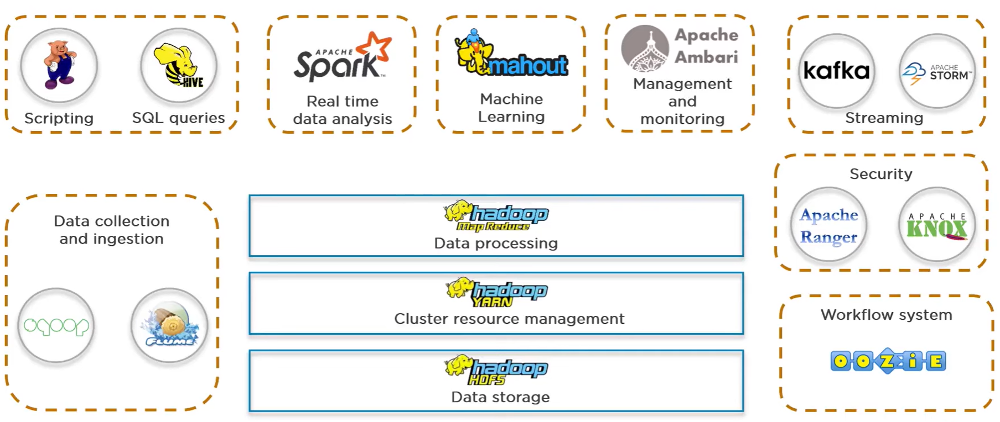
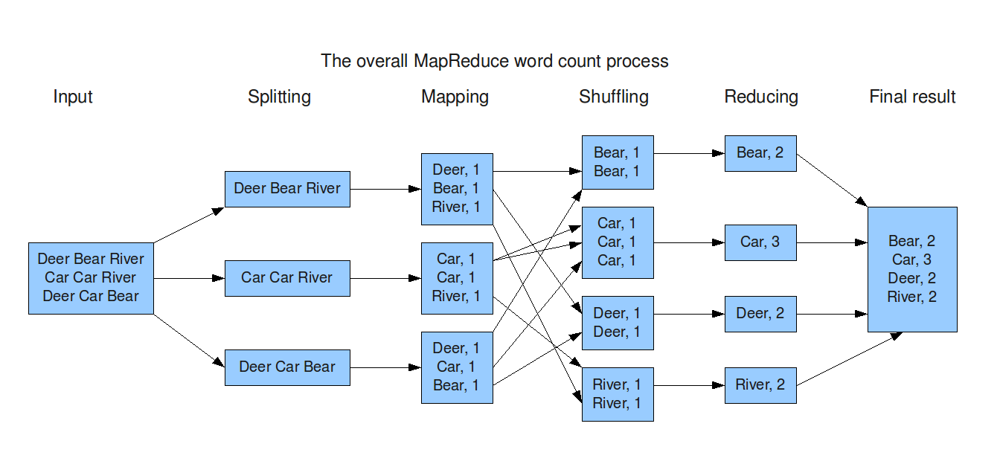

## Uvod
Apache Hadoop je open-source framework dizajniran da se skalira od jednog servera do velikog broja mašina, pri čemu svaka obezbeđuje lokalnu obradu i skladištenje podataka. Na taj način omogućava skladištenje i obradu velikih skupova podataka u distribuiranom računarskom okruženju.

Framework koristi snagu klasterskog računanja, pri čemu se podaci obrađuju u malim delovima raspoređenim preko više servera u okviru klastera.

Takođe, fleksibilnost Hadoop-a u radu sa velikim brojem drugih alata čini ga osnovom savremenih big data platformi, jer pruža pouzdan i skalabilan način da organizacije izvuku vredne uvide iz sve većih količina podataka.

## Komponente
Apache Hadoop nije monolitni sistem, već platforma oko koje je izgrađen bogat ekosistem alata za skladištenje, obradu, integraciju, analitiku i upravljanje velikim količinama podataka.

U samom jezgru Hadoop-a nalazi se skup osnovnih komponenti koje obezbeđuju distribuirano skladištenje podataka, paralelnu obradu i upravljanje resursima. Ove komponente čine stabilnu i skalabilnu osnovu na koju se nadovezuju brojni dodatni alati.

Oko Hadoop jezgra razvijen je čitav ekosistem servisa koji rešavaju specifične probleme, kao što su:
- unos i prenos podataka (npr. Sqoop, Flume, Kafka),
- obrada i analitika podataka (Pig, Hive, Spark, Mahout),
- orkestracija i automatizacija poslova (Oozie, Zookeeper),
- upravljanje, nadzor i bezbednost klastera (Ambari, Ranger, Knox).

Važno je naglasiti da ovi alati nisu deo osnovnog Hadoop jezgra, ali u praksi igraju ključnu ulogu u izgradnji kompletnih big data platformi. Oni koriste osnovne Hadoop servise (HDFS, YARN i ostale) kao infrastrukturnu osnovu, dok sami obezbeđuju napredne funkcionalnosti prilagođene konkretnim poslovnim potrebama.

 

Četiri osnovne komponente Hadoop-a čine temelj njegovog sistema i omogućavaju distribuirano skladištenje i obradu podataka.
### 1. Hadoop Common
Predstavlja skup osnovnih Java biblioteka koje su zajedničke svim Hadoop modulima i omogućavaju njihovo pravilno funkcionisanje.

### 2. Hadoop Distributed File System (HDFS)
HDFS je distribuirani fajl sistem sa podrškom za velike skupove podataka, koji obezbeđuje visok protok podataka uz visoku dostupnost i otpornost na greške.

Jednostavno rečeno, to je skladišna komponenta Hadoop-a — čuva velike količine podataka raspoređene na više mašina i može da radi na standardnom hardveru, što ga čini isplativim rešenjem.

### 3. Hadoop YARN
YARN (Yet Another Resource Negotiator) obezbeđuje okvir za raspoređivanje poslova i upravlja sistemskim resursima u distribuiranim sistemima.

Ukratko, to je komponenta za upravljanje resursima u Hadoop-u, koja kontroliše resurse korišćene za obradu podataka smeštenih u HDFS-u.

### 4. Hadoop MapReduce

Jednostavan programski model koji obrađuje podatke paralelno tako što nestrukturisane podatke pretvara u parove ključ–vrednost (mapiranje), zatim ih raspoređuje po čvorovima i kombinuje rezultate u konačni izlaz (redukcija).

To je centralni mehanizam obrade podataka Hadoop-a, koji obezbeđuje glavne mogućnosti obrade kroz dve faze glavne faze: mapiranje i redukciju.

 

## Bezbednost
Bezbednost Hadoop-a predstavlja jedinstvene izazove zbog njegove distribuirane arhitekture i oslanjanja na servise trećih strana, što ga čini posebno ranjivim na napade ako nije pravilno zaštićen.

### Izazovi bezbednosti Hadoop-a
Implementacije Hadoop-a podložne su svim bezbednosnim izazovima koji važe za savremene distribuirane sisteme. Ovi izazovi se razlikuju od monolitnih aplikacija koje pristupaju tradicionalnim bazama podataka.

**Primeri:**
- Podaci u Hadoopu su raspoređeni na više čvorova. Bez pravilnog šifrovanja podataka u mirovanju, kompromitovan čvor može omogućiti neovlašćenom korisniku da pristupi delovima fajlova, otkrije osetljive podatke ili menja vrednosti.

- Servisi u Hadoopu obično rade na odvojenim čvorovima i koriste mrežu za međusobnu komunikaciju. Bez pravilnog šifrovanja podataka u transportu, sistem je ranjiv na man-in-the-middle napade. Napadač može presresti osetljive podatke ili ubaciti maliciozni kod.

Ono što Hadoop čini posebno složenim je veliki broj servisa trećih strana u ekosistemu koji se koriste za specifične potrebe. Mnogi od ovih servisa mogu raditi i nezavisno od Hadoop-a, pa imaju svoje samostalne bezbednosne implementacije i podrazumevane konfiguracije.

Zbog toga je važno imati sveobuhvatnu strategiju bezbednosti za Hadoop klaster, kako bi se pojedinačni servisi mogli konfigurisati tako da koriste jedinstveni pristup u rešavanju uobičajenih bezbednosnih problema. U suprotnom, čitav sistem može biti ranjiv na krađu podataka i prekide servisa.

### Osnovni principi bezbednosti
Rani dizajn i razvoj Hadoop-a fokusirao se na visoku dostupnost i skalabilnost skladištenja i analitike podataka; bezbednost nije bila ključna komponenta. Ali u produkcionim implementacijama bezbednost mora biti temeljna stavka.

Pet ključnih oblasti na koje treba obratiti pažnju kako bi se osigurala osnovna bezbednost informacija (poverljivost, integritet i dostupnost):
1. **Autentifikacija** – Osigurava da samo poznati i registrovani korisnici i servisi mogu pristupiti Hadoop klasteru.

2. **Autorizacija** – Zahteva da autentifikovani korisnici i servisi imaju eksplicitno odobren pristup aplikacijama, podacima i servisima kojima upravlja Hadoop klaster.

3. **Šifrovanje** – Štiti podatke koji su pohranjeni (_at rest_) u sistemu, kao i podatke koji se prenose (in motion) unutar sistema, od neovlašćenog pristupa.

4. **Izolacija** – Sprečava da jedan korisnik, servis ili grupa troši resurse klastera na način koji bi kompromitovao performanse za druge korisnike ili ugrozio dostupnost sistema u celini.

5. **Sanacija (Remediation)** – Kombinacija alata i procesa koji prate sistem i preduzimaju akcije kako bi identifikovali i otklonili pretnje bezbednosti, dostupnosti ili stabilnosti.

### Najbolje prakse za poboljšanje bezbednosti
Bezbednost u Hadoopu mora se implementirati **u slojevima**, kako bi se kreirala robusna strategija koja garantuje poverljivost, integritet i dostupnost sistema. Svaki sloj može zaštititi ceo sistem, ali ga treba posmatrati kao prepreku za napadače, a ne kao zid. Ključno je implementirati svaki sloj kako bi se odbili napadi i minimalizovali efekti eventualnog proboja.

**Preporučene prakse:**
- **Promenite podrazumevane lozinke i komunikacione portove**  
    Mnogi servisi u Hadoop ekosistemu imaju podrazumevane korisničke podatke i lozinke, kao i portove za komunikaciju. Ovi podaci su lako dostupni u dokumentaciji i repozitorijumima koda, pa ih je neophodno promeniti kako bi se sprečio neovlašćen pristup.

- **Koristite privatnu mrežu**  
    Hadoop klaster i povezani servisi trebalo bi da budu na privatnoj mreži, koja nije dostupna sa interneta (uz VPN za daljinski pristup po potrebi). Ako to nije moguće, koristite firewall, reverse proxy i bezbedne gateway tehnike da sakrijete detalje implementacije od potencijalnih napadača.

- **Koristite Kerberos autentifikacioni protokol**  
    Kerberos omogućava:
    - **Recipročnu autentifikaciju** – i klijent i server verifikuju identitet pre pristupa, smanjujući rizik od man-in-the-middle napada.
    - **Single sign-on (SSO)** – korisnik pristupa svim servisima bez višestrukog unosa lozinke; koristi se privremeni tiket za naredne zahteve, smanjujući šansu za otmicu sesije.

- **Šifrovanje podataka**
    - Koristite Transparent Data Encryption (TDE) u HDFS-u za šifrovanje podataka u mirovanju.
    - Konfigurišite SSL/TLS za šifrovanje saobraćaja u transportu između klijenata i servisa.

- **Upravljanje dozvolama preko RBAC-a (Role-Based Access Control)**  
    Omogućava organizovan, politikama zasnovan pristup podacima i servisima, olakšava audit i održavanje privilegija.

- **Princip najmanjih privilegija (PoLP)**  
    Korisnici i servisi dobijaju minimalan pristup potreban za obavljanje zadataka. Ovo ograničava pristup pojedinačnih korisnika i smanjuje površinu napada u slučaju kompromitovanja naloga.

### Alati za bezbednost
Postoji nekoliko alata koji se često koriste za implementaciju i upravljanje bezbednošću Hadoop-a. Osnovni su već pomenuti Kerberos i TDE. Ostali važni alati:
- **YARN Capacity Scheduler** – ugrađen u Hadoop, koristi se za dodelu kvota korisnicima i servisima, čime se obezbeđuje izolacija resursa i stabilnost sistema.

- **Apache Ranger i Apache Sentry** – alati za centralizovanu autorizaciju i upravljanje politikama pristupa podacima i servisima u Hadoop ekosistemu. Apache Ranger omogućava fino-granulisanu kontrolu pristupa, audit logovanje i praćenje aktivnosti u realnom vremenu, dok je Apache Sentry starije rešenje sa fokusom na role-based pristup, koje se danas sve ređe koristi u novim implementacijama.

- **Apache Knox** – igurnosni gateway i reverse proxy koji predstavlja jedinstvenu ulaznu tačku za spoljne klijente. Knox štiti Hadoop klaster od direktne izloženosti mreži, primenjuje autentifikaciju i autorizaciju na nivou API-ja i omogućava bezbedan pristup servisima bez otkrivanja interne arhitekture klastera.