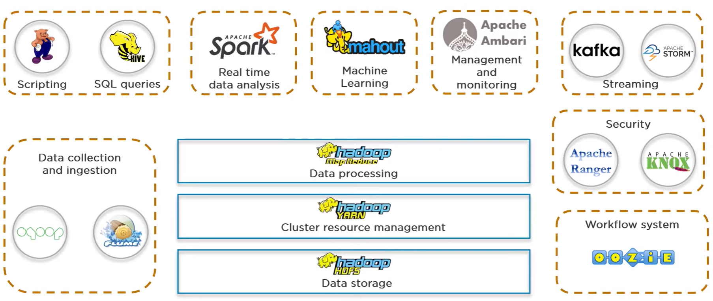
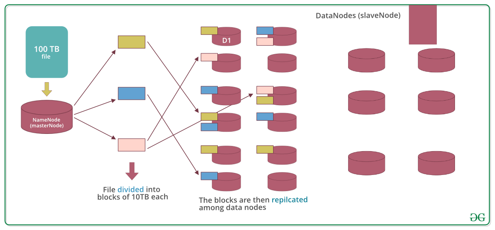
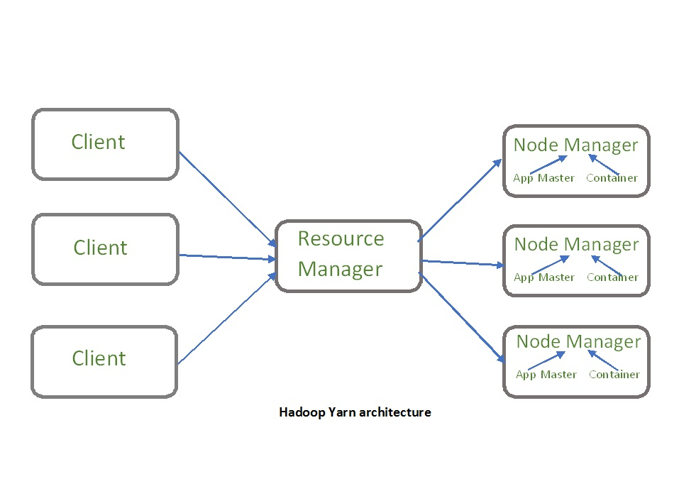
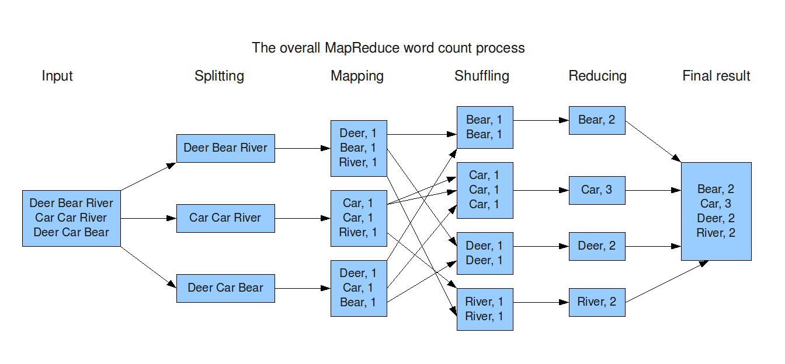

## Uvod
Apache Hadoop je open-source framework dizajniran da se skalira od jednog servera do velikog broja mašina, pri čemu svaka obezbeđuje lokalnu obradu i skladištenje podataka. Na taj način omogućava skladištenje i obradu velikih skupova podataka u distribuiranom računarskom okruženju.

Framework koristi snagu klasterskog računanja, pri čemu se podaci obrađuju u malim delovima raspoređenim preko više servera u okviru klastera.

Takođe, fleksibilnost Hadoop-a u radu sa velikim brojem drugih alata čini ga osnovom savremenih big data platformi, jer pruža pouzdan i skalabilan način da organizacije izvuku vredne uvide iz sve većih količina podataka.

## Komponente
Apache Hadoop nije monolitni sistem, već platforma oko koje je izgrađen bogat ekosistem alata za skladištenje, obradu, integraciju, analitiku i upravljanje velikim količinama podataka.

U samom jezgru Hadoop-a nalazi se skup osnovnih komponenti koje obezbeđuju distribuirano skladištenje podataka, paralelnu obradu i upravljanje resursima. Ove komponente čine stabilnu i skalabilnu osnovu na koju se nadovezuju brojni dodatni alati.

Oko Hadoop jezgra razvijen je čitav ekosistem servisa koji rešavaju specifične probleme, kao što su:
- unos i prenos podataka (npr. Sqoop, Flume, Kafka),
- obrada i analitika podataka (Pig, Hive, Spark, Mahout),
- orkestracija i automatizacija poslova (Oozie, Zookeeper),
- upravljanje, nadzor i bezbednost klastera (Ambari, Ranger, Knox).

Važno je naglasiti da ovi alati nisu deo osnovnog Hadoop jezgra, ali u praksi igraju ključnu ulogu u izgradnji kompletnih big data platformi. Oni koriste osnovne Hadoop servise (HDFS, YARN i ostale) kao infrastrukturnu osnovu, dok sami obezbeđuju napredne funkcionalnosti prilagođene konkretnim poslovnim potrebama.

   

Četiri osnovne komponente Hadoop-a čine temelj njegovog sistema i omogućavaju distribuirano skladištenje i obradu podataka.
### 1. Hadoop Common
Hadoop Common predstavlja skup osnovnih Java biblioteka i pomoćnih alata koji služe kao temelj celokupnog Hadoop ekosistema. Ove biblioteke obezbeđuju zajedničke funkcionalnosti koje koriste svi ostali Hadoop moduli.

Ključne funkcionalnosti:
- Apstrakcija fajl sistema koja omogućava rad sa različitim sistemima za skladištenje (HDFS, Amazon S3, Azure Blob Storage)
- Biblioteke za serijalizaciju i deserijalizaciju podataka
- Mehanizmi za autentifikaciju i autorizaciju korisnika
- Alatke za upravljanje konfiguracijom sistema
- RPC (Remote Procedure Call) biblioteke za komunikaciju između komponenti

Hadoop Common omogućava da sve komponente Hadoop-a lako komuniciraju i dele zajedničku infrastrukturu, što olakšava razvoj i održavanje sistema.

### 2. Hadoop Distributed File System (HDFS)
HDFS je distribuirani fajl sistem sa podrškom za velike skupove podataka, koji obezbeđuje visok protok podataka uz visoku dostupnost i otpornost na greške.

To je skladišna komponenta Hadoop-a — čuva velike količine podataka raspoređene na više mašina i može da radi na standardnom hardveru, što ga čini isplativim rešenjem.

#### Čvorovi (Nodes)
Master-slave čvorovi obično formiraju **HDFS klaster**.
1. NameNode (Glavni Čvor)**:
    - Upravlja svim podređenim čvorovima i dodeljuje im poslove.
    - Izvršava operacije nad prostorom imena sistema datoteka kao što su otvaranje, zatvaranje i preименовање datoteka i direktorijuma.
    - Treba da bude postavljen na pouzdanom hardveru visoke konfiguracije, a ne na standardnom hardveru (pre svega veća količina RAM memorije).
2. DataNode (Podređeni Čvor):
    - Pravi radni čvorovi koji obavljaju stvarni posao poput čitanja, pisanja, obrade, itd.
    - Takođe izvršavaju kreiranje, brisanje i replikaciju na osnovu instrukcija od glavnog čvora.
    - Mogu biti postavljeni na standardnom hardveru.
    - Zahtevaju veliku memoriju jer se ovde zapravo čuvaju podaci.

   

Kada se unese velika datoteka (npr. 100TB), NameNode (glavni čvor) je deli na blokove po 128MB. Ti blokovi se distribuiraju i čuvaju na različitim DataNode-ovima (radnim čvorovima). Svaki blok se automatski replicira 3 puta (podrazumevano) na različite čvorove radi otpornosti na kvar. NameNode vodi evidenciju gde se nalazi svaki blok i njene replike.

Lakše je čuvati i obrađivati mnogo malih blokova nego jednu ogromnu datoteku - brži pristup podacima i manje vreme pretrage.

Ako neki DataNode otkaže, podaci nisu izgubljeni jer postoje kopije na drugim čvorovima - sistem nastavlja da radi bez problema.
### 3. Hadoop YARN
YARN (Yet Another Resource Negotiator) obezbeđuje okvir za raspoređivanje poslova i upravlja sistemskim resursima u distribuiranim sistemima.
To je komponenta za upravljanje resursima u Hadoop-u, koja kontroliše resurse korišćene za obradu podataka smeštenih u HDFS-u.
#### Glavne komponente YARN arhitekture
   

**1) Klijent (Client)**
Pokreće i šalje aplikaciju (npr. MapReduce posao) YARN-u. Komunicira sa Resource Manager-om, prati status posla i dobija ažuriranja od Application Master-a. Predstavlja korisnički interfejs za pokretanje aplikacija na Hadoop klasteru.

**2) Resource Manager**
Glavni demon YARN-a odgovoran za dodelu i upravljanje resursima za sve aplikacije. Ima dve glavne komponente:

- **Scheduler**: Raspoređuje poslove na osnovu dostupnih resursa. Čisti raspoređivač - ne prati izvršavanje niti garantuje restart ako posao ne uspe. Podržava dodatke kao Capacity i Fair Scheduler.
- **Application Manager**: Prihvata aplikacije i pregovara o prvom kontejneru sa Resource Manager-om. Restartuje Application Master kontejner ako dođe do greške.

**3) Node Manager**
Upravlja pojedinačnim čvorom u klasteru. Registruje se kod Resource Manager-a i šalje periodične signale o stanju čvora. Prati upotrebu resursa, upravlja logovima i ubija kontejnere po nalogu Resource Manager-a. Kreira kontejner proces na zahtev Application Master-a.

**4) Application Master**
Odgovoran za jednu aplikaciju - pregovara o resursima sa Resource Manager-om, prati status i napredak aplikacije. Zahteva kontejnere od Node Manager-a šaljući Container Launch Context (CLC) koji sadrži sve potrebno za pokretanje aplikacije. Periodično šalje izveštaje Resource Manager-u.

**5) Container**
Kolekcija fizičkih resursa (RAM, CPU jezgra, disk) na jednom čvoru. Pokreće se preko Container Launch Context-a (CLC) koji sadrži informacije kao što su promenljive okruženja, sigurnosni tokeni i zavisnosti.

#### Workflow
→ Klijent podnese aplikaciju 
→ Resource Manager dodeljuje kontejner i pokreće Application Master 
→ Application Master se registruje kod Resource Manager-a 
→ Application Master pregovara o kontejnerima sa Resource Manager-om 
→ Application Master naređuje Node Manager-ima da pokrenu kontejnere 
→ Aplikacija se izvršava u kontejnerima 
→ Klijent prati status preko Resource Manager-a/Application Master-a 
→ Po završetku, Application Master se odjavljivuje i oslobađa resurse.

### 4. Hadoop MapReduce

MapReduce je Hadoop framework za obradu velikih podataka raspoređenih na više mašina. Radi direktno sa podacima smeštenim u HDFS-u i deli veliki dataset na manje delove koji se obrađuju paralelno.

#### Proces

**1. Input Split (Podela ulaza)**
Ulazni podaci se dele na manje delove zvane Input Splits. Svaki split obrađuje zaseban Mapper. 

**2. Mapper faza**
Svaki Mapper radi paralelno na različitim čvorovima i obrađuje jedan split.
- Čita podatke liniju po liniju
- Transformiše ih u ključ-vrednost parove
- Čuva privremeni izlaz lokalno (ne u HDFS)

**3. Shuffling & Sorting (Mešanje i sortiranje)**
Hadoop automatski:
- Razvrstava privremene ključ-vrednost parove
- Grupište sve vrednosti sa istim ključem
- Sortira ih pre slanja Reducer-u

**4. Reducer faza**
Reducer prima listu vrednosti za svaki jedinstveni ključ.
- Primenjuje agregaciju (suma, prosek, filtriranje)
- Generiše finalni izlaz
- Čuva rezultat u HDFS
## Bezbednost
Bezbednost Hadoop-a predstavlja jedinstvene izazove zbog njegove distribuirane arhitekture i oslanjanja na servise trećih strana, što ga čini posebno ranjivim na napade ako nije pravilno zaštićen.

### Alati za bezbednost
Postoji nekoliko alata koji se često koriste za implementaciju i upravljanje bezbednošću Hadoop-a. Osnovni su već pomenuti Kerberos i TDE. Ostali važni alati:
- **YARN Capacity Scheduler** – ugrađen scheduler u Hadoop-u koji omogućava deljenje velikog klastera između više organizacija uz garantovane kapacitete (kvote) za svaku, čime se izbegavaju troškovi privatnih klastera i postiže bolja iskorišćenost resursa. Organizacije dele klaster prema svojim potrebama, ali mogu koristiti i višak kapaciteta koji drugi ne koriste. Sistem obezbeđuje strogu izolaciju resursa i limite koji sprečavaju neproporcionalno korišćenje od strane pojedinačnih aplikacija ili korisnika, čime se garantuje stabilnost sistema. Osnovna apstrakcija su redovi zadataka (queues) organizovani hijerarhijski, što osigurava da se slobodni resursi prvo dele unutar organizacije pre nego što postanu dostupni drugima.

- **Apache Ranger** –
	- Apache Ranger je open-source framework za upravljanje, praćenje i nadzor bezbednosti podataka na Hadoop platformi. Pruža centralizovano upravljanje bezbednosnim politikama i detaljnu reviziju korisničkog pristupa.
	- **Ključne funkcionalnosti**
		- Centralizovana administracija – upravljanje bezbednošću kroz centralni UI ili REST API
		- Centralizovana revizija – praćenje korisničkog pristupa i administrativnih akcija u Hadoop ekosistemu (HDFS, Hive, HBase, Storm, Knox, Solr, Kafka i drugi)
		- Dinamička evaluacija politika – bezbednosne politike se prosleđuju Hadoop komponentama za izvršavanje
	- **Arhitektura** (tri glavne komponente) 
		- Ranger Admin – centralizovano upravljanje politikama
		- Ranger Usersync – sinhronizacija sa LDAP/AD
		- Ranger Key Management Service – upravljanje ključevima za enkripciju u HDFS-u
	- Apache Ranger je idealan za kompleksne arhitekture jer pokriva prevenciju curenja podataka, bezbedno deljenje, kontrolu pristupa, enkripciju i upravljanje ključevima.

- **Apache Knox** 
	- Sigurnosni gateway i reverse proxy koji predstavlja jedinstvenu ulaznu tačku za spoljne klijente. Knox štiti Hadoop klaster od direktne izloženosti mreži, primenjuje autentifikaciju i autorizaciju na nivou API-ja i omogućava bezbedan pristup servisima bez otkrivanja interne arhitekture klastera. 
	
	- **Ključne funkcionalnosti**
		- Autentifikacija i potvrda identiteta
		- Primena autorizacije
		- Revizija na nivou servisa
	
	- Primarna funkcija Knox-a je obezbeđivanje sigurnog pristupa Hadoop klasterima kroz autentifikaciju, potvrdu identiteta, autorizaciju i reviziju na nivou servisa.

