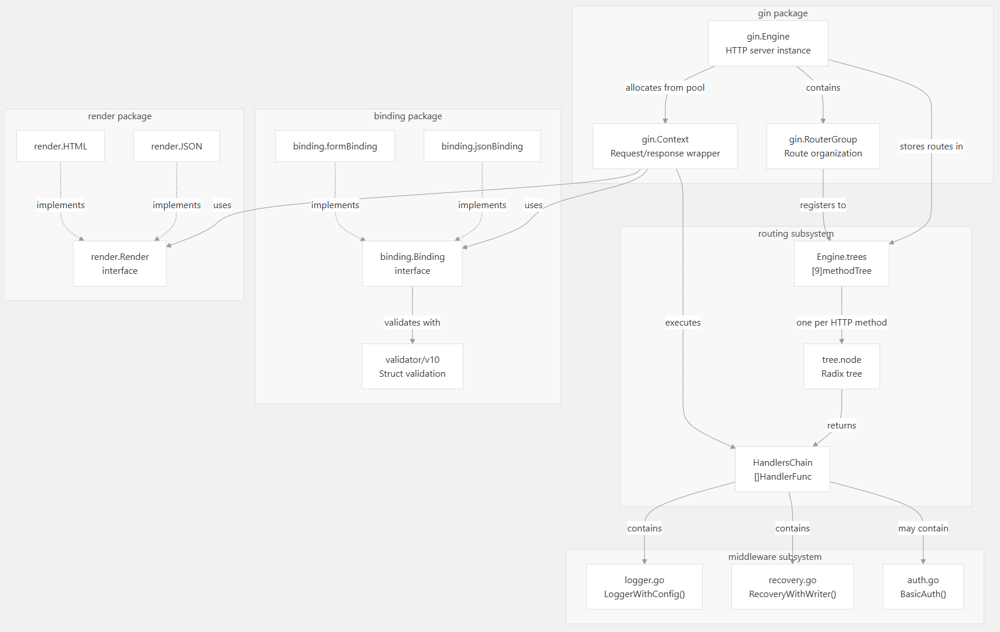
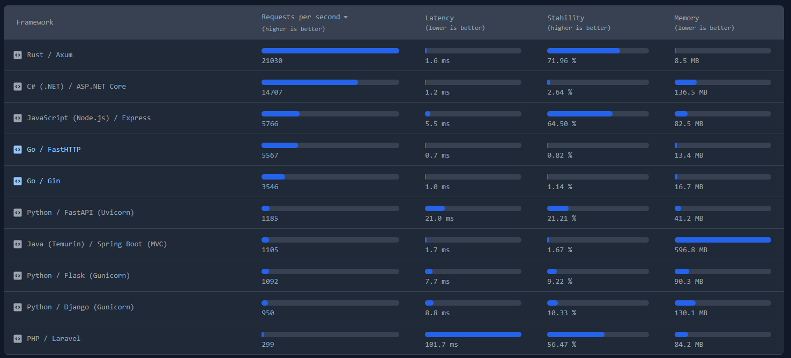

## Uvod

Gin je HTTP web framework visokih performansi napisan u programskom jeziku **Go**. Pruža API sličan Martini framework-u, ali sa znatno boljim performansama, čak do 40 puta brži, zahvaljujući *httprouter* biblioteci. Gin je namenjen za izradu REST API-ja, web aplikacija i mikroservisa, gde su brzina i produktivnost programera od ključnog značaja.

Gin kombinuje jednostavnost rutiranja u stilu Express.js-a sa performansama koje pruža Go, što ga čini idealnim za:
- Izgradnju REST API-ja sa velikim protokom zahteva
- Razvoj mikroservisa koji moraju da obrađuju veliki broj konkurentnih zahteva
- Kreiranje web aplikacija koje zahtevaju brzo vreme odziva
- Brzo prototipiranje web servisa uz minimalnu količinu pomoćnog koda

## Arhitektura



1. Jezgro sistema
	- Engine
		- Centralni koordinator – `gin.Engine` je glavna struktura koja upravlja celokupnim životnim ciklusom aplikacije
		- Konfiguracija – Čuva globalnu konfiguraciju, uključujući middleware-e, templejt engine, i podešavanja za HTML renderovanje
		- Pool objekata – Koristi `sync.Pool` za efikasno recikliranje `Context` objekata i smanjenje opterećenja garbage collector-a
		- Funkcionalnosti:
		    - Inicijalizacija i pokretanje HTTP servera
		    - Registracija ruta i middleware-a
		    - Upravljanje RouterGroup objektima -> (omogućavaju hijerarhijsku organizaciju ruta sa zajedničkim prefiksima i middleware-ima.)
	- Context
		- enkapsulira HTTP zahtev i odgovor. Svaki dolazni zahtev dobija sopstveni Context objekat koji se reciklira nakon obrade.
		- Pruža pristup HTTP zahtevu (`*http.Request`) i odgovoru (`http.ResponseWriter`)
		- Omogućava pristup URL parametrima, query parametrima i podacima iz forme
		- **Executes** - Izvršava HandlersChain (lanac middleware-a i handler-a)
		- Pruža metode za renderovanje (JSON, XML, HTML, String, File)
		- Čuva session podatke kroz ključ-vrednost mapu
2. Routing Podsistem
	- Httprouter (RadixTree)
	- Implementacija radix tree algoritma koji omogućava izuzetno brzo pronalaženje ruta.
	- Karakteristike:
		- Podrška za parametrizovane rute (`/user/:id`)
		- Podrška za wildcard rute (`/files/*filepath`)
		- Zero memory allocations - Ne pravi heap alokacije tokom rutiranja
		- Returns - Vraća HandlersChain koji odgovara pronađenoj ruti 
3. Middleware Podsistem
	- Middleware lanac
		- Funkcionalni wrapper – Svaki middleware je funkcija oblika `func(*Context)`
		- Next() mehanizam – `c.Next()` poziva sledeći middleware/handler u lancu
		- Abort() mehanizam – `c.Abort()` prekida izvršavanje lanca
	- Ugrađeni middleware-i
		- Logger – Logovanje dolaznih zahteva sa detaljima (metod, URL, status kod, trajanje)
		- Recovery – Hvatanje panic-a i sprečavanje pada servera
		- CORS – Cross-Origin Resource Sharing
		- BasicAuth – HTTP Basic autentifikacija
		- Gzip – Kompresija odgovora
4. Binding i validacija
	- Binding paket omogućava automatsko mapiranje podataka iz HTTP zahteva u Go strukture sa validacijom.
	- Binding engine
		- **Model binding** – Automatsko mapiranje podataka iz zahteva u Go strukture
		- **Izvori podataka**:
		    - JSON body (`c.ShouldBindJSON()`)
		    - XML body (`c.ShouldBindXML()`)
		    - Form data (`c.ShouldBind()`)
		    - Query parametri (`c.ShouldBindQuery()`)
		    - Headers (`c.ShouldBindHeader()`)
		    - URI parametri (`c.ShouldBindUri()`)
	- Validator
		- Tag-based validacija – Korišćenje struct tag-ova za definisanje pravila:
		- ```
			  type User struct {
			    Email    string `json:"email" binding:"required,email"`
			    Age      int    `json:"age" binding:"gte=0,lte=130"`
			    Password string `json:"password" binding:"required,min=8"`
			}
		  ```
		- Automatska validacija nakon binding-a
		- Podrška za custom validatore
		- Detaljna error poruke za nevalidne podatke
5. Renderovanje
	- Render paket omogućava generisanje HTTP odgovora u različitim formatima kroz unificirani interfejs.
	- Render interface
		- Centralni interfejs koji definiše kako se podaci renderuju u HTTP odgovor. Različite implementacije podržavaju različite formate.
		- Content-Type handling – Automatsko postavljanje odgovarajućih header-a
		- Tipovi renderera:
			- JSON (sa opcijom za Pretty print)
			- XML
			- HTML (sa template engine-om)
			- YAML
			- ProtoBuf
			- Plain text
			- Binary data
6. Upravljanje greškama
	- Error collection

		- Error lista – Context čuva niz svih grešaka nastalih tokom obrade zahteva
		- Error types – Kategorizacija grešaka (public, private, binding errors)
		- Metadata – Mogućnost dodavanja dodatnih informacija uz grešku
	
	- Error handling middleware
		- Centralizovano rukovanje – Jedan middleware na kraju lanca obrađuje sve greške
		- Formatiranje odgovora – Transformacija grešaka u odgovarajući format (JSON, XML, itd.)
		- Logovanje – Automatsko zapisivanje grešaka u log
7. Mehanizmi za optimizaciju
	-  Object pooling
		- sync.Pool za Context – Recikliranje Context objekata između zahteva
		- Smanjenje GC pritiska – Manje heap alokacija = ređe pokretanje garbage collector-a
	- Zero-copy operations
		- Direktan pristup baferima – Izbegavanje nepotrebnog kopiranja podataka
		- Response streaming – Efikasno slanje velikih odgovora
	- Lazy parsing
		- On-demand parsiranje – Parametri i body se parsiraju samo kad se zatraže
		- Keširano parsiranje – Rezultati se čuvaju u Context-u za ponovnu upotrebu
8. Tok obrade klasičnog zahteva
	1. Dolazak zahteva → HTTP zahtev stiže na gin.Engine
	2. Alociranje Context-a → Engine alocira gin.Context iz pool-a
	3. Rutiranje → RouterGroup pronalazi odgovarajuću rutu u Engine.trees
	4. Pronalaženje handler-a → tree.node (radix tree) vraća HandlersChain
	5. Binding → Context koristi binding.Binding za parsiranje podataka
	6. Validacija → validator validira parsovane podatke
	7. Izvršavanje lanca → Context izvršava HandlersChain (middleware + handler)
	8. Renderovanje → Handler koristi render.Render za generisanje odgovora
	9. Vraćanje odgovora → HTTP odgovor se šalje klijentu
	10. Recikliranje → Context se vraća u sync.Pool za ponovno korišćenje


## Poređenje sa drugim frameworks

This benchmark tests how fast a framework can perform concurrent HTTP requests, I/O operations, and JSON de/serialization.  
  
OS: Linux/DockerCPU: Ryzen 7 7800X3DLast Updated: 2025-08-24

 

preuzeto sa https://sharkbench.dev/web/go


## Bezbednost Gin-a
Prema poslednjoj verziji (**v1.11.0**), ne postoje poznati bezbednosni problemi koji su direktno prijavljeni u samom framework-u. Održavaoci projekta aktivno objavljuju ispravke za otkrivene ranjivosti u novijim verzijama.

Na osnovu pregleda github repozitorijuma https://github.com/gin-gonic izvučeno je sledeće:

Učestalost commit-ova
- Otvoreni issue-i: 675
- Otvoreni pull request-ovi: 215
- Novi pull request-ovi: 1
- Poslednje izdanje: pre 3 meseca
- Poslednji commit: pre 14 dana

Ovim je utvrđeno je da Gin ima pozitivan ritam objavljivanja i ažuriranja verzija i da se projekat kontinualno održava. 

### Potencijalni problemi
Iako sam Gin framework nema poznate kritične ranjivosti, nepravilna konfiguracija i neadekvatna upotreba njegovih funkcionalnosti mogu dovesti do ozbiljnih bezbednosnih problema na nivou aplikacije.

#### 1. Mass assignment ranjivost usled nekontrolisanog bind-ovanja

Gin omogućava automatsko mapiranje HTTP zahteva na Go strukture korišćenjem metoda kao što su `Bind()` i `ShouldBindJSON()`. Ako se ove metode koriste bez jasno definisanih struktura za unos, napadač može proslediti dodatna polja koja aplikacija ne očekuje.

To može dovesti do neovlašćene izmene kritičnih vrednosti, poput uloge korisnika ili privilegija.
##### Kako se sprečava
- Koristiti posebne DTO (Data Transfer Object) strukture za unos podataka
- Izbegavati bind-ovanje direktno na interne ili domenske modele
- Definisati eksplicitna validaciona pravila korišćenjem `binding` tagova 
- 
	Username string `json:"username" binding:"required,min=3,max=30"`
    Email    string `json:"email" binding:"required,email"`

- Ručno mapirati dozvoljena polja iz DTO strukture u domenski model
---
#### 2. XSS i injection napadi usled nevalidiranog unosa

Gin ne vrši automatsku sanitizaciju korisničkog unosa. Ako se nevalidirani podaci direktno koriste u HTML odgovorima, SQL upitima ili komandama sistema, aplikacija postaje ranjiva na XSS, SQL injection i slične napade.
##### Kako se sprečava
- Uvek validirati korisnički unos koristeći Gin-ov `validator` mehanizam
- Koristiti ORM alate (npr. GORM) sa parametrizovanim upitima
- Izbegavati generisanje HTML-a sa neproverenim podacima
- Primeniti escape mehanizme pri prikazu korisničkog sadržaja
---
#### 3. Izlaganje internih informacija kroz debug režim

Ukoliko Gin aplikacija ostane u debug režimu u produkcionom okruženju, može doći do izlaganja detaljnih poruka o greškama, stack trace-ova i informacija o rutama aplikacije.

Ove informacije mogu biti iskorišćene za dalje napade.
##### Kako se sprečava
- Postaviti aplikaciju u release režim (`gin.ReleaseMode`) u produkciji
- Onemogućiti prikaz detaljnih grešaka krajnjim korisnicima
- Logovati detalje grešaka isključivo na serverskoj strani
---
#### 4. Denial of Service (DoS) napadi usled neograničenih zahteva

Gin ne nameće ograničenja na veličinu HTTP zahteva. Napadač može poslati izuzetno velike zahteve ili fajlove, čime se iscrpljuju serverski resursi.
##### Kako se sprečava
- Korišćenjem prilagođenog Gin middleware-a za ograničavanje veličine HTTP zahteva  
- Podešavanjem `MaxMultipartMemory` parametra radi kontrole veličine upload fajlova  
- Konfigurisanjem timeout-a (`ReadTimeout`, `WriteTimeout`) na nivou Go HTTP servera
---
#### 5. Neadekvatna CORS konfiguracija

Previše liberalna CORS konfiguracija može omogućiti zlonamernim domenima da šalju zahteve u ime korisnika, što može dovesti do CSRF i krađe sesija.
##### Kako se sprečava
- Koristiti CORS middleware sa strogo definisanim pravilima
- Ograničiti dozvoljene origin-e na pouzdane domene
- Izbegavati kombinaciju `AllowOrigins: *` i `AllowCredentials: true`
---
#### 6. Nezaštićene rute usled pogrešne primene middleware-a

Ako se middleware za autentifikaciju ili autorizaciju ne primeni dosledno na sve osetljive rute, pojedini endpoint-i mogu ostati nezaštićeni.
##### Kako se sprečava
- Grupisati rute koje zahtevaju autentifikaciju korišćenjem `router.Group()`
- Primeniti middleware na nivou grupa, a ne pojedinačnih ruta
- Redovno pregledati definicije ruta tokom razvoja
---
#### 7. Brute-force napadi usled nedostatka rate limiting-a

Gin ne sadrži ugrađene mehanizme za ograničavanje broja zahteva. Endpoint-i poput login forme mogu biti izloženi brute-force napadima.
##### Kako se sprečava
- Implementirati rate limiting middleware
- Ograničiti broj zahteva po IP adresi ili korisniku
- Privremeno blokirati IP adrese sa sumnjivim ponašanjem

## Ublažavanje rizika i najbolje prakse

Kako bi se obezbedila Gin aplikacija, programeri bi trebalo da:

- **Redovno ažuriraju framework**  
    Održavajte Gin uvek na najnovijoj verziji kako bi sve poznate ranjivosti bile zakrpljene. Zvanični GitHub repozitorijum i **Snyk** baza ranjivosti pružaju ažurne informacije.
    
- **Implementiraju bezbednosna HTTP zaglavlja**  
    Gin framework nudi primer kako dodati ključna bezbednosna zaglavlja (poput **Content-Security-Policy** i **X-Frame-Options**) radi zaštite od čestih web napada. https://gin-gonic.com/en/docs/examples/security-headers/

- **Sanitizuju korisnički unos**  
    Uvek validirajte i sanitizujte sav unos koji dolazi od korisnika kako biste sprečili napade poput SQL injection-a (koji je ranjivost na nivou aplikacije, a ne framework-a), Cross-Site Scripting (XSS) napada i path traversal ranjivosti.

- **Koriste SecureJSON mehanizam za zaštitu od JSON hijacking napada**  
    Gin pruža `SecureJSON` metodu koja dodaje zaštitni prefiks u JSON odgovore koji sadrže nizove. Ovaj mehanizam sprečava izvršavanje JSON odgovora kao JavaScript koda u starijim ili nebezbedno konfigurisanima klijentima, čime se ublažava rizik od JSON hijacking napada.

- **Koriste bezbednosni middleware**  
    Razmotrite korišćenje middleware-a trećih strana koji pružaju sveobuhvatnu zaštitu od različitih web ranjivosti. (na primer https://github.com/wprimadi/gin-security-middleware)


