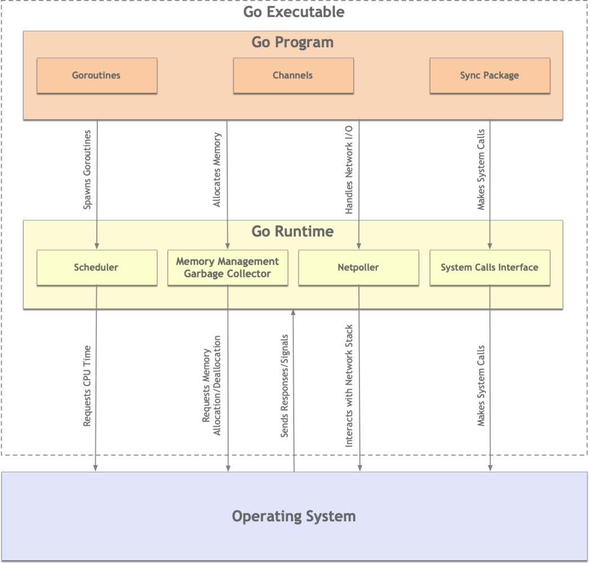

## Uvod
**Go (Golang)** je programski jezik koji su 2007. godine razvili Rob Pike, Ken Thompson i Robert Griesemer u kompaniji Google, a 2009. je objavljen kao open-source projekat. Reč je o kompajliranom, statički tipiziranom i višepardigmatskom jeziku opšte namene.

Sintaksa Go-a je jednostavna i delimično podseća na C, što nije slučajno, jer je prvi Go kompajler bio napisan u C-u. Danas je Go self-hosted, odnosno njegov kompajler je implementiran upravo u Go jeziku. Fokus jezika je na čitljivosti, jednostavnosti i visokoj efikasnosti.

Jedna od ključnih karakteristika Go-a je snažna podrška za konkurentno programiranje. Jezik je dizajniran tako da maksimalno iskoristi moderne višejezgarne procesore i omogući jednostavno paralelno izvršavanje zadataka. Ova osobina ga čini posebno pogodnim za savremene serverske i distribuirane sisteme.

Go koristi automatsko upravljanje memorijom putem garbage collection-a, što rasterećuje programere manuelnog upravljanja memorijom i doprinosi stabilnosti aplikacija. Iako koristi pokazivače, Go ne dozvoljava njihovu aritmetiku, čime se smanjuje mogućnost grešaka tipičnih za nižerazinske jezike.

## Kada koristiti Golang
Golang je svestran jezik i koristi se u širokom spektru aplikacija. Posebno se ističe u web razvoju, gde njegova jednostavnost, performanse i ugrađena podrška za konkurentnost dolaze do izražaja. Standardna biblioteka pruža snažnu podršku za mrežnu komunikaciju i HTTP servise.

Go je veoma popularan u razvoju mikroservisa i distribuiranih sistema, zahvaljujući malom memorijskom otisku, brzom pokretanju i efikasnom modelu konkurentnosti. Često se koristi i za razvoj CLI alata, sistemskih utilitija i aplikacija koje zahtevaju visoke performanse i obradu velikog protoka podataka.

## Ključni elementi jezika

1. **Goroutine-e**
	- Goroutine-e su jezgro Go-vog konkurentnog modela - lake, jeftine niti kojima upravlja Go runtime, ne operativni sistem. Pokretanje goroutine-a je trivijalno (samo `go` keyword), a njihova cena je minimalna (par KB memorije). Scheduler iz runtime-a inteligentno raspoređuje goroutine-e na dostupne OS niti, omogućavajući hiljadama goroutine-a da se izvršavaju konkurentno bez opterećivanja sistema.
2. **Channel-i**
	- Channel-i su tip-sigurne cevi za komunikaciju između goroutine-a, implementirajući "ne delite memoriju komunikacijom, već komunicirajte deljenjem memorije" filozofiju. Oni rešavaju većinu problema sinhronizacije bez potrebe za eksplicitnim lock-ovima. Runtime kroz netpoller integrisan sa OS-om omogućava efikasnu I/O operaciju bez blokiranja goroutine-a.
3. Sync paket
	- Sync paket nudi primitivne za sinhronizaciju niskog nivoa (Mutex, WaitGroup, Once) za retke situacije kada channel-i nisu pogodni. Iako su dostupni, Go idiomi favorizuju channel-e gde god je moguće, rezervišući sync primitivne za zaštitu deljenih struktura podataka ili koordinaciju jednostavnih zadataka.
4. Garbage collector
	- Automatski upravlja memorijom, oslobađajući programere brige o alokaciji/dealokaciji. Go koristi concurrent mark-and-sweep algoritam optimizovan za niske pause, što je kritično za server aplikacije. Runtime dinamički alocira i dealocira memoriju, omogućavajući goroutine-ama da se fokusiraju na logiku bez rizika od memory leak-ova.
5. Runtime i Scheduler
	- Runtime upravlja schedulingom goroutine-a koristeći M:N model (M goroutine-a na N OS niti). Scheduler koristi work-stealing algoritam za balansiranje opterećenja između procesorskih jezgara. Kada goroutine izvrši blokrajuću sistemsku operaciju, scheduler automatski prebacuje CPU na drugu goroutine, maksimizujući iskorišćenost resursa.
6. Netpoller i System Calls
	- Netpoller omogućava neblokirajuće mrežne I/O operacije kroz integraciju sa OS mehanizmima. Kada goroutine zahteva mrežnu operaciju, netpoller je parkira dok podaci ne stignu, oslobađajući scheduler da izvršava druge goroutine-e. Sistemski pozivi se rukuju kroz dedikovan interfejs koji minimizira tranzicije između user-space i kernel-space.

## Standardna biblioteka i alati
Jedna od velikih prednosti Go-a je izuzetno bogata standardna biblioteka, koja omogućava razvoj ozbiljnih aplikacija bez oslanjanja na veliki broj eksternih paketa. Paketi poput `net/http`, `encoding/json`, `database/sql` i `io` pokrivaju većinu uobičajenih potreba.

Go dolazi sa moćnim skupom alata koji su sastavni deo jezika: kompilacija, testiranje, formatiranje koda, benchmarking, profiling i fuzz testiranje. Ovi alati značajno unapređuju produktivnost i kvalitet koda.

Upravljanje zavisnostima realizuje se kroz Go module, definisane u fajlu `go.mod`, što omogućava jednostavno i bezbedno upravljanje verzijama paketa.

## Bezbednost i ranjivosti
### 1. Bezbednost u dizajnu Go jezika (Security by design)
Go smanjuje čitavu klasu ranjivosti koje su česte u C/C++.
#### 1.1 Upravljanje memorijom i garbage collection
- Nema manuelnog `malloc/free` → nema:
    - use-after-free
    - double free
    - većine buffer overflow problema
- Garbage collector automatski upravlja životnim ciklusom objekata
- Poređenje sa jezicima bez GC-a (C/C++) – zašto su memory safety bugovi ređi u Go-u

Go ne eliminiše sve bezbednosne probleme, ali značajno smanjuje rizik od kritičnih memory corruption ranjivosti.

---
#### 1.2 Ograničena upotreba pokazivača
- Go dozvoljava pokazivače, ali:
    - nema aritmetike pokazivača
    - nema direktnog pristupa memoriji van granica
- Time se sprečavaju:
    - out-of-bounds pristupi
    - klasični heap/stack overflow napadi
    - Izuzetak predstavljaju delovi koda koji koriste paket `unsafe`
---
#### 1.3 Statički i strogo tipiziran
- Statička tipizacija
- Manje runtime grešaka
- Kompajler hvata veliki broj logičkih grešaka pre izvršavanja

---

### 2. Konkurentnost i bezbednost
Iako Go pojednostavljuje konkurentno programiranje, ne eliminiše sve probleme koji iz njega mogu proisteći. Nepravilna upotreba gorutina i kanala može dovesti do ozbiljnih bezbednosnih posledica.
#### 2.1 Race conditions
- Gorutine olakšavaju paralelizam, ali:
    - deljeni resursi bez sinhronizacije → race condition
- Posledice:
    - nekonzistentni podaci
    - nepredvidivo ponašanje
    - potencijalni sigurnosni propusti (npr. neispravna autorizacija)
---
#### 2.2 Deadlock i resource exhaustion
- Nepravilno korišćenje kanala:
    - blokirajuće gorutine
    - curenje gorutina (goroutine leaks)
- Mogućnost DoS napada:
    - nekontrolisano kreiranje gorutina
    - neograničeni request handleri
---
### 3. Ranjivosti u Go aplikacijama
#### 3.1 Injection napadi
- Go sam po sebi ne štiti od injection napada
- Opasnosti:
    - dinamičko sklapanje SQL upita
- Dobre prakse:
    - prepared statements
    - ORM-ovi ili `database/sql` pravilna upotreba
---
#### 3.2 XSS i CSRF u web aplikacijama
- `html/template` vs `text/template`
- Automatsko escaping ponašanje
- Gde programeri greše:
    - manuelni HTML
    - JSON → HTML render bez validacije
---
#### 3.3 Neadekvatno rukovanje greškama
- Ignorisanje `err`
- Vraćanje generičkih poruka
- Mogućnost:
    - curenja internih informacija
    - pogrešnog toka autorizacije
---
#### 3.4 Command Injection i os/exec rizici
Command injection je bezbednosna ranjivost koja nastaje kada aplikacija prosleđuje neproverene korisničke ulaze u sistemske komande koje se izvršavaju na serveru — što omogućava napadaču da izvršava proizvoljne komande na tom sistemu. U Go-u se ovakve ranjivosti obično javljaju pri korišćenju paketa `os/exec` za pokretanje spoljne komande koristeći ulaz direktno iz zahteva ili drugog nevalidiranog izvora.
Mitigacija:
1. **Validacija i sanitacija ulaza** – pre nego što korisnički unosi dospeju u komandnu liniju, proveri ih i dozvoli samo očekivane vrednosti (npr. numeričke opsege ili dozvoljene stringove), i ukloni opasne karaktere poput `;`, `|`, `&`.
2. **Izbegavanje sistemskih komandi** gde god je moguće – izbegavati pozivanje sistemskih komandi gde god je moguće. Umesto njih korisiti sigurne API ili biblioteke koje rade traženu funkcionalnost.
3. **Konstrukcija komandi bez shell-a** – kada je neophodno koristiti sistemske komande, koristi `exec.Command` sa zasebnim argumentima umesto spajanja stringova u jednu komandu, kako bi se ulaz tretirao kao podatak, a ne kao izvršivi kod.
---
### 4. Bezbednost standardne biblioteke
#### 4.1 Kriptografija
- `crypto/*` paketi:
    - `crypto/tls`
    - `crypto/rand`
- Prednosti:
    - sigurni default-i
- Opasnosti:
    - korišćenje zastarelih algoritama
    - loša konfiguracija TLS-a
---
#### 4.2 HTTP server i default podešavanja
- `net/http` je moćan, ali:
    - nema timeout-a po default-u
- Rizici:
    - Slowloris DDos napadi
    - resource exhaustion
---
### 5. Upravljanje zavisnostima i supply chain bezbednost
#### 5.1 Go moduli
- Prednosti:
    - verzionisanje
    - reprodukovani build-ovi
- Rizici:
    - kompromitovani paketi
    - transitive dependencies
#### 5.2 Alati za proveru ranjivosti
Go ekosistem pruža zvanične alate za identifikaciju poznatih bezbednosnih ranjivosti u zavisnostima aplikacije (najznačajniji `govulncheck`).
- `govulncheck` analizira izvorni kod i zavisnosti projekta i proverava da li aplikacija koristi pakete koji sadrže **poznate ranjivosti** evidentirane u **Go Vulnerability Database**. Za razliku od klasičnih dependency scanner-a, ovaj alat proverava **da li se ranjivi kod zaista koristi**, a ne samo da li je prisutan u zavisnostima.
- Go Vulnerability Database predstavlja centralizovanu bazu ranjivosti specifičnih za Go pakete. Ona sadrži proverene informacije o bezbednosnim problemima, uključujući opis ranjivosti, pogođene verzije i preporučena rešenja. Ovakav pristup značajno smanjuje lažno pozitivne rezultate i pomaže programerima da fokusiraju pažnju na stvarne rizike.
---
### 6. Alati i prakse za povećanje bezbednosti
Pored samog dizajna jezika, Go ekosistem nudi brojne alate i prakse koji pomažu u ranom otkrivanju bezbednosnih problema i unapređenju kvaliteta koda. Njihova redovna upotreba predstavlja važan deo secure development lifecycle-a.
- `go vet` - otkriva sumnjive konstrukcije i potencijalne logičke greške koje mogu dovesti do bezbednosnih problema
- `staticcheck` - napredna statička analiza koja pronalazi suptilne greške i loše prakse
- `gosec` - fokusiran na identifikaciju čestih bezbednosnih ranjivosti u Go kodu
- fuzz testiranje (`go test -fuzz`) - automatski pronalazi edge case-ove i neočekivana ponašanja
- secure coding guidelines - dosledna primena principa poput najmanjih privilegija i eksplicitnog rukovanja greškama
---

